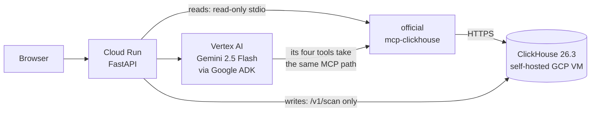

# Safe Frame

A film is approved once. Then it becomes dozens of versions: different frame
rates, ad-break inserts, social crops, subtitle burn-ins. Photosensitivity
testing runs on the master, before any of that happens.

Safe Frame asks the question that testing the master cannot answer: **did one of
those conversions introduce a flash risk the approved master did not have?**

**Live app: <https://safe-frame-regression-109051079423.us-central1.run.app>**

ClickHouse track. Every verdict on the site is a ClickHouse result, computed
when you press the button.

## Try it in sixty seconds

1. Open the link above and press **Run every live check**.
2. Four panels answer from ClickHouse: the catalogue sweep, an accuracy score,
   the systemic cause, and which components are answering right now.
3. Click any row whose rule reads **Red flash**. Look at the luminance line in
   the chart. It barely moves. A luminance-only checker passes that file.

Each panel reports the second it ran and what the round trip cost, because a
deterministic query over a fixed corpus returns the same numbers every time and
that is indistinguishable from a cached page unless the page says otherwise.

## How it fits together



The important part of that picture is what is missing. **Gemini has no path to
a verdict.** It reads database evidence through the same read-only MCP server
and writes prose. Pass or fail is decided by SQL, every time. If MCP fails or
the count cannot be parsed, the API returns 502 rather than guessing.

The MCP subprocess receives ClickHouse credentials and nothing else. It cannot
reach Google credentials.

## The idea

Existing tools judge *a file*. Detection, repair, viewer-side dimming and
networked batch analysis are all mature. Our documented search found file-level
analysers and an explicitly no-reference enterprise QC product, but no
documented check that compares a rendition against **its own approved parent**
and attributes a newly introduced violation to the transform that caused it.
That is a gap in public documentation, not proof that no private integration
exists.

Safe Frame aligns master and rendition on **presentation time, never frame
index**, because a 24 to 60 fps conversion renumbers every frame and preserves
pts. Then a child-minus-parent isolation in ClickHouse keeps only the
violations the master did not already have.

### Two rules, and the one most tools miss

Thresholds are not ours to pick. Every one traces to WCAG 2.3.1, quoted in
[`docs/CRITERIA.md`](docs/CRITERIA.md).

- **General flash.** Luminance alternation at or above a 0.10 delta, and only
  when the darker image is below 0.80.
- **Red flash.** Saturated-red alternation at or above a 0.20 red delta, with
  **no luminance condition at all.**

That second rule is the whole point. A red-to-grey alternation can hold
luminance almost flat and still be the higher-risk sequence. Gate it on
luminance and you reproduce the exact blind spot the rule exists to close. On
the live corpus, **23 of the 66 findings are red-flash only**, so a
luminance-only workflow misses every one of them.

Each rule gets its own 1000 ms window, so one rule's transitions can never pad
the other's count, and the isolation is keyed on rule: a master that already
flashed in luminance does not excuse a rendition that introduced a red flash.

## Does it actually work

The fair objection to a synthetic corpus is that it is circular. Data was
generated with flashes in it, and then the flashes were found.

[`sql/008_ground_truth.sql`](sql/008_ground_truth.sql) answers that. It recovers
the planted set from the generator's own planting decisions and reads **no
measurement column at all**: not `luma_delta`, not `red_delta`, not `luma_min`,
not `changed_area_fraction`, not `direction`. Two queries produced by
independent means. Agreement between them is a result rather than a
restatement.

On the live corpus: **66 planted, 66 found, precision 1.000, recall 1.000**,
and all 86 decoys correctly rejected.

The decoys are what make the number worth anything, because recall alone can be
bought by flagging everything. Seventy of them carry a real flash burst and are
still not regressions, because their master has the same burst at the same
presentation time. Seventeen clear every floor but sit above the published
darker-image ceiling. The two sets are drawn independently and one rendition
landed in both, which is why seventy plus seventeen is eighty-six and not
eighty-seven.

The two cohorts are scored apart and they agree: 1.000 on the 400 authored
titles, and 1.000 on the 24 whose every value was measured from constructed RGB
frames rather than chosen. That is what rules out the corpus doing the work.

This measures agreement with a ground truth we authored. It is not evidence
about real footage and it establishes no clinical efficacy.

## From a count to something a team can act on

Sixty-six findings is not sixty-six problems.
`/v1/catalogue/transform-risk` asks the next question: of every conversion in
the catalogue, how many renditions did it produce and how many did it break?

The answer is **four implicated encoder profiles and three clean ones**.
`60fps_interp` and `adbreak_insert` produce every luminance regression between
them; `subtitle_burnin` and `social_crop_v` produce every red one. That is four
upstream configurations to fix, rather than sixty-six outputs to patch one at a
time, and fixing them stops the next unsafe version being made.

## What it is built from

**ClickHouse, through the official MCP server.** Every catalogue read and every
live verdict goes through `ClickHouse/mcp-clickhouse` in read-only stdio mode,
against a self-hosted ClickHouse 26.3 LTS cluster on a dedicated GCP VM with a
SELECT-only MCP user. One long-lived session per event loop rather than a
subprocess per request, which removes four to eight seconds of handshake from
every call. All three tools the server advertises are called, not just the one
this product needs: `list_databases` and `list_tables` prove the session reaches
a real cluster with a real schema, which `run_query` alone cannot.

The criteria are **evaluated in SQL**, not read from a precomputed column. The
1000 ms window is a `RANGE BETWEEN CURRENT ROW AND 999 FOLLOWING`; direction is
encoded so that `min(dir) != max(dir)` is exactly "both directions present".

**ClickHouse Agent Skills.** All 31 official rules were worked through against
this schema. Most were applied. Four were declined with measurements showing
why, including one where the recommended single-scan shape measured 27 percent
slower on our data, because per-granule min/max already skips about 93 percent
of the second scan.
[`docs/CLICKHOUSE-SKILLS-REVIEW.md`](docs/CLICKHOUSE-SKILLS-REVIEW.md) accounts
for every one.

One of those declines is worth reading on its own.
[`sql/007_refreshable_regressions.sql`](sql/007_refreshable_regressions.sql) is
a refreshable materialized view that serves the sweep from 44 rows in 5.9 ms
instead of 10,263,552 rows in 932 ms. Identical output, about 158 times faster,
and exactly what ClickHouse's own guidance recommends. It is deliberately not
enabled, because this site claims nothing on it is precomputed, and serving that
button from a five-minute-old view would make the claim false. The DDL ships so
a real deployment can create it in one statement.

**Google Cloud.** Two real ADK agents on Gemini 2.5 Flash via Vertex AI.
`RegressionExplainer` is single-step and bound to one validated pair.
`QcTriageAgent` has four tools over the same read-only MCP transport and
sequences them itself: survey the sweep, profile every transform, size the
red-flash blind spot, then go deep on the pair it ranks first. The tool-call
sequence is recorded and returned with the brief, so the multi-step work is
checkable rather than asserted. Cloud Run runs under a dedicated
`safe-frame-runtime` identity with Secret Manager, and every agent run and every
fail-closed refusal lands in Cloud Logging as structured `jsonPayload`:

```bash
gcloud logging read 'jsonPayload.event="agent_run"' --limit 20 --format json
```

No submitted metrics and no model prose are logged.

## Check your own video

Three routes, in increasing order of how much you do yourself.

1. **On the page.** Choose a video in the "Your video" section, or press one of
   the three bundled sample scenarios. It is decoded in your browser, never
   uploaded and never played back at you, and only downscaled samples are sent.
   Add the approved master as a second file to ask the regression question
   instead of the absolute one.
2. **`POST /v1/analyze`** with decoded RGB samples, if you want the service to
   run the measurement stage for you. Nothing is stored.
3. **Measure frames yourself** with `safe_frame.ingest.frames_to_transitions`
   and post the transition rows to `/v1/scan`.

Frames are measured on a small grid, which every response states. The published
area condition is a proportion of the screen, so a few hundred cells resolve it;
a flash too small for the grid does not meet the area condition anyway.

## Using the API

**Every endpoint works with no credential at all.** The whole judge path can be
exercised without an account, a quota or a signup. Press **Run every endpoint**
on the page to watch all nine read endpoints answer in your browser.

Keys are optional and only raise limits. They never gate access.

```bash
BASE=https://safe-frame-regression-109051079423.us-central1.run.app

# Google's load balancer rejects a POST with no Content-Length before it
# reaches the service, so send an explicit empty body.
curl -s -X POST "$BASE/v1/keys" -H 'content-type: application/json' -d '{}'

curl -s "$BASE/v1/keys/self" -H "Authorization: Bearer $KEY"   # or X-API-Key
```

A key is stateless: an identifier and an issue date, signed with an HMAC the
server holds. Verification is a signature check, so there is no credential
table, no write on the request path, and nothing lost when an instance
restarts. The cost is real and stated on the key itself: an individual key
cannot be revoked without rotating the signing secret, so keys expire 90 days
after issue. A missing credential is the anonymous tier; a present but broken
one is refused with the reason rather than silently downgraded.

Two consequences are handled rather than ignored. `/v1/scan` persists what it is
given and the per-pair anti-join reads the same table, so a fixed sample
identifier would be shared mutable state and an anonymous write onto a published
master could suppress a real finding; `/v1/samples` mints a fresh lineage per
request and catalogue identifiers are refused as write targets. `/v1/triage` and
`/v1/explain` spend model tokens, so they are capped per client per minute, as
is the write path. No read endpoint is capped.

### Endpoints

| Endpoint | What it gives you |
|---|---|
| `/` | the page itself, no flashing media |
| `/health` | live Vertex and MCP round trips |
| `/v1/catalogue/shape` | size of the corpus, read live |
| `/v1/catalogue/sweep` | both rules across the whole catalogue |
| `/v1/catalogue/regressions` | the verdict for one asset pair |
| `/v1/catalogue/timeline` | per-second transitions for a master and rendition |
| `/v1/catalogue/transform-risk` | per-transform regression rates |
| `/v1/evaluation` | the detector scored against planted ground truth |
| `/v1/stack` | every component, and which are answering right now |
| `/v1/integrations/clickhouse/evidence` | all three MCP tools called live |
| `/v1/triage` | the multi-step agent brief, with its tool-call sequence |
| `/v1/explain` | an ADK explanation grounded in MCP evidence |
| `/v1/analyze` | measure frames you supply, store nothing |
| `/v1/scan` | submit transition rows for a parent and child pair |
| `/v1/samples` | a fresh, isolated pass/fail pair |
| `/v1/keys`, `/v1/keys/self` | mint an optional key, check your tier |
| `/samples/{name}` | the three bundled sample clips |
| `/docs` | the complete OpenAPI surface |

## Run and verify it yourself

```bash
python -m pip install -r requirements-dev.txt
python -m pytest -q                       # 92 passed, 47 skipped without a cluster
python -m uvicorn safe_frame.main:app --reload
```

```bash
python -m pip install playwright
python -m playwright install chromium
python scripts/visual_check.py --offline  # needs no cluster
```

`scripts/visual_check.py` drives a real browser. `--offline` serves the web
directory with no backend, so every fetch fails, and requires that
initialisation completes with zero page errors, the toggles respond, and a
failing sweep reports failing closed. It then stubs the endpoints and drives the
whole evidence path. It exists because a script that throws at init detaches
every listener while every assertion about page *content* still passes, and that
has happened twice.

`tests/test_sql_parity.py` runs the reference Python detector and the ClickHouse
SQL over identical randomized rows and requires exact agreement on both rules:
46 parity cases including the six-versus-seven boundary, the darker-image
ceiling and a red alternation at matched luminance, plus two that call every
tool the MCP server advertises. The `parity` CI job stands up a throwaway
ClickHouse and runs all 48 through the real official `mcp-clickhouse` transport
**on every commit**, and fails if any of them skip.

That job exists because of a defect it would have caught. The tests needed a
cluster, CI had none, so they skipped everywhere: 45 green skips reading as a
pass. Under that cover, the parametrized case compared the SQL's first *row*
against the detector's whole result list. It could never have passed. The two
implementations did agree once the comparison was fixed, but for weeks nothing
demonstrated it. A test that cannot run is a claim, not evidence.

## What this is not

It is **not a certified, broadcaster-approved, or medical diagnostic device.**
The detector and the SQL are an open pre-check against published criteria.
Gemini may explain database evidence; it cannot decide pass or fail. Safe Frame
implements two of the three published tests and does not implement the spatial
pattern rule, which is named on the page rather than left implied. The corpus is
self-authored and synthetic, and contains no filmed footage.

## Read further

| Document | What is in it |
|---|---|
| [`JUDGING.md`](JUDGING.md) | the shortest verified judge path |
| [`docs/CLICKHOUSE-SKILLS-REVIEW.md`](docs/CLICKHOUSE-SKILLS-REVIEW.md) | all 31 partner rules, applied, measured or declined |
| [`docs/CRITERIA.md`](docs/CRITERIA.md) | where every threshold came from |
| [`docs/STACK.md`](docs/STACK.md) | every component and the measurements behind each choice |
| [`docs/IMPACT.md`](docs/IMPACT.md) | who this is for, and what has not been shown |
| [`docs/PRIVACY.md`](docs/PRIVACY.md) | what each endpoint keeps, and what it does not |
| [`docs/LIMITATIONS.md`](docs/LIMITATIONS.md) | the honest edges |
| [`docs/PRIOR-ART.md`](docs/PRIOR-ART.md) | what already exists, and what we could not find |
| [`docs/LIVE-ACCEPTANCE.json`](docs/LIVE-ACCEPTANCE.json) | measurements read from the deployment |
| [`submission-evidence.json`](submission-evidence.json) | machine-readable proof |

## License

Apache-2.0. See [`LICENSE`](LICENSE) and [`NOTICE`](NOTICE).
